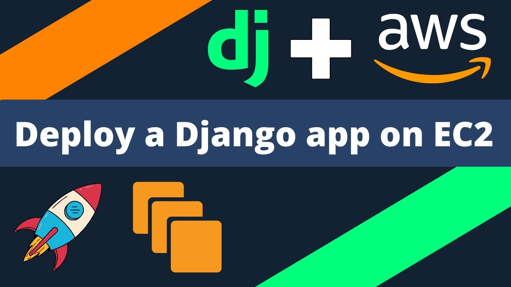
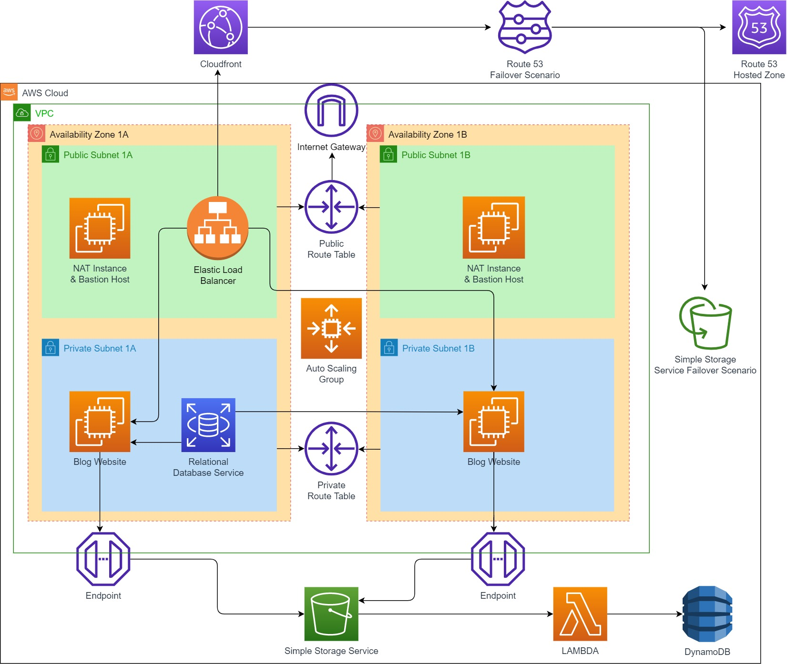
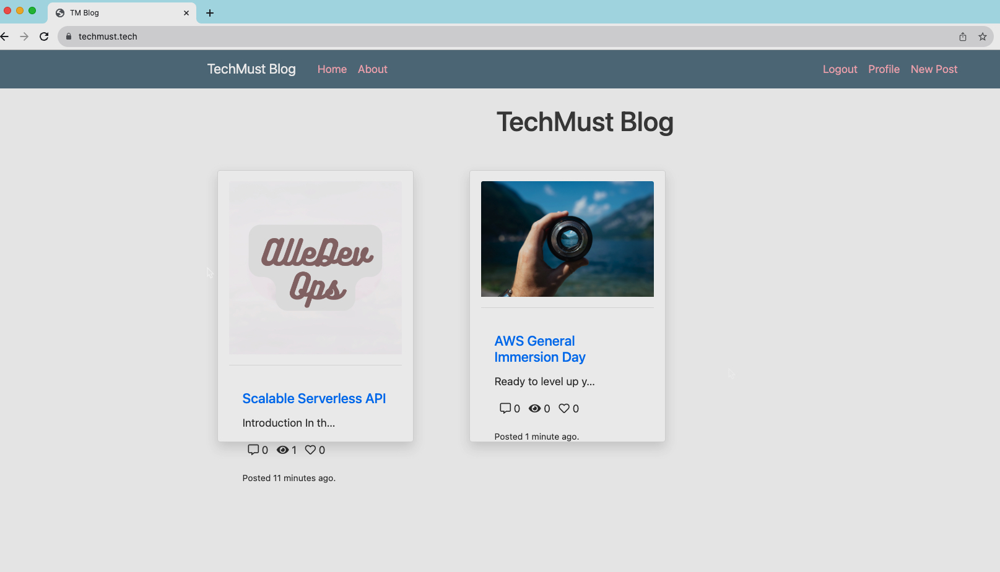

# Building a Secure and Scalable Django Blog on AWS

## Project Summary

This project deploys a Django-based blog application on AWS using various services such as EC2, RDS, S3, DynamoDB, CloudFront, and Route 53. The end result is a scalable and secure web application where users can upload pictures and videos on their blog pages, which are stored on an S3 bucket and recorded on a DynamoDB table.

## Technologies Used
- AWS IAM
- VPC
- EC2
- RDS
- Amazon S3
- AWS Certificate Manager (SSL/TLS)
- CloudFront
- Route 53
- CloudFormation
- Amazon API Gateway
- AWS Lambda
- DynamoDB
- Python 3.8
- SQL

## Project Skeleton

To successfully deploy the **TechMust Blog** Page Application on AWS infrastructure with the desired architecture, we will structure our project into several key components. This project skeleton will include:

### 1\. Amazon Web Services (AWS)

* **Amazon Virtual Private Cloud (VPC)**: We will configure a VPC with specific characteristics to isolate our application.
    
* **Amazon Elastic Compute Cloud (EC2) Instances** : These instances will host our Django web application, and we'll utilize Launch Templates to streamline the setup process.
    
* **Amazon Relational Database Service (RDS)**: We'll set up an RDS instance to store user registration data using MySQL.
    
* **Amazon Simple Storage Service (S3)**: S3 will serve as our storage solution for user-uploaded pictures and videos, and we will define two S3 buckets for regular use and failover.
    
* **AWS Certificate Manager**: We will use this service to create SSL certificates for secure connections, both on Application Load Balancer (ALB) and Amazon CloudFront.
    
* **Amazon CloudFront**: Configured as a cache server, CloudFront will efficiently manage content delivery from ALB.
    
* **Amazon Route 53**: It will be responsible for secure and reliable routing of traffic, allowing us to publish the website and ensuring failover in case of issues.
    
* **Amazon DynamoDB**: This NoSQL database will store an object list of S3 Bucket content, ensuring efficient data retrieval.
    
* **AWS Lambda**: A Python 3.8 Lambda function will be implemented to write objects from S3 to the DynamoDB table.
    
* **AWS Identity and Access Management (IAM)**: We'll define IAM roles and policies to grant necessary permissions to EC2 instances, Lambda function, and other resources.
    

### 2\. Configuration Components

* **Security Groups**: We will create and configure security groups for our ALB, EC2 instances, and RDS, ensuring secure traffic flow.
    
* **NAT Instance or Bastion Host**: Depending on your choice, we will set up the necessary components for secure access to private resources.
    

### 3\. Project GitHub Repository

We will set up a project repository on GitHub to store the application code, infrastructure configurations, and other project-related files.

### 4\. Developer Notes

We will follow the developer notes provided by the developer team to prepare the Django environment on EC2 instances, deploy the application, and configure RDS settings.

### 5\. Requirements.txt

This file will include the required Python packages and dependencies for the Django application.

## Monitoring and Alerting

To monitor the application and *infrastructure health*, we use **AWS CloudWatch**. CloudWatch gathers and displays *performance metrics*, *logs*, and *events*. By analyzing these metrics and logs, we can identify potential issues and performance bottlenecks.

## Security and Compliance

### IAM Roles and Policies

We enforce **fine-grained access control** using IAM roles and policies. Each AWS component follows the principle of least privilege, ensuring that entities only have the necessary permissions. This minimizes security vulnerabilities and unauthorized access.

### Data Encryption

- **At Rest:** Sensitive data, including the database, is encrypted using Amazon RDS encryption, providing an additional layer of protection for persistent storage.

- **In Transit:** All data exchanged between components is encrypted using secure communication protocols like **HTTPS**, safeguarding against eavesdropping or man-in-the-middle attacks.

### Network Security

- **VPC Isolation:** The project operates within a dedicated VPC, ensuring logical segmentation and preventing unauthorized access.

- **Security Groups and NACLs:** These are used to control inbound and outbound traffic, allowing us to define and enforce security policies at the network level.

### Compliance Considerations

- **GDPR Compliance:** Adherence to GDPR guidelines ensures lawful and transparent processing of personal data.

- **Data Residency:** We comply with relevant regulations and geographical restrictions for data storage and processing.

- **Audit Logging:** Comprehensive audit logs track system activities, supporting compliance audits and providing visibility into security incidents.

## Implementation Guide

To implement the project step by step using the AWS Management Console, you can follow this **project design narrative** in my **blog website**: https://alledevops.com/building-a-secure-and-scalable-django-blog-on-aws-the-ultimate-guide

The guide provides detailed instructions on **how to successfully deploy** the TechMust Blog Page Application on AWS infrastructure with the desired architecture.

## Outcome
Please check the [outcomes](./outcomes/) folder to view all the images and videos that validate the project promises.

https://github.com/alledevops/blog-page-app-django-on-aws/assets/75995111/c5d34461-00b0-42f3-8f85-b7f7d3a5b65f

## Overcoming Challenges

1. **EC2 Instance Health Check Failure:**
   - **Issue:** Faced health check failed errors on EC2 instances, despite no apparent issues with the instances themselves.
   - **Resolution:** Discovered errors in the execution of prompts within the `userdata.sh` script. Manually **installed missing libraries**, updated the `userdata.sh` file, and ensured successful server operation.

2. **DynamoDB Data Sync Issue with Lambda:**
   - **Issue:** Observed that although the blog application was running and S3 objects were created, DynamoDB did not have corresponding object information.
   - **Resolution:** Investigated both DynamoDB and Lambda functions, finding that Lambda was successfully triggered. Discovered that **running Lambda in a private VPC** required creating a dedicated security group for Lambda and granting necessary permissions on the DynamoDB security group. Implemented these adjustments to resolve the issue.

These challenges underscore the importance of thorough debugging, script updates, and understanding the intricacies of AWS service interactions. Successfully addressing these hurdles contributed to the robust functionality of the deployed application.

## Room for Growth

 Of course there are exciting possibilities for further refinement and expansion. Here are some thoughtful suggestions that could elevate the project:

### Enhanced Security for DynamoDB:
- Consider reinforcing DynamoDB's security by refining IAM roles and policies, embracing the principle of least privilege. This could involve periodic reviews and updates to align permissions with evolving business needs. Additionally, enabling **AWS Key Management Service (KMS)** encryption for DynamoDB would add an extra layer of protection to sensitive data.

### Secure S3 Bucket Configuration:
- Evaluate and tighten access control policies for the S3 bucket, utilizing IAM roles and **bucket policies** to restrict access. Enabling **versioning** for the S3 bucket could be explored to maintain a historical record of changes, offering an added layer of protection against accidental deletions or unauthorized modifications.

### Automated Deployment with AWS CodePipeline:
- Explore the integration of AWS CodePipeline to introduce a continuous integration and deployment (CI/CD) pipeline. This could significantly streamline the development process, automate testing, and enhance deployment practices. **Continuous integration and deployment** would ensure that each code change undergoes rigorous testing before being deployed to different environments.

These suggestions open avenues for growth and improvement in our project, providing a roadmap to bolster security measures, fortify access controls, and streamline deployment processes. Embracing these enhancements could contribute to a more **resilient and efficient** Django-based blog application on the AWS platform.

## Conclusion

In conclusion, this AWS-deployed Django blog project excels in security, scalability, and compliance. Overcoming challenges like EC2 health checks and DynamoDB sync underscores its robustness. These experiences contribute to a resilient and efficient application.

## References

- AWS Documentation: 
  - https://docs.aws.amazon.com/lambda/latest/dg/foundation-networking.html
  - https://docs.aws.amazon.com/autoscaling/ec2/userguide/ts-as-healthchecks.html
- Github: https://github.com/devenes/my-aws-capstone-project
